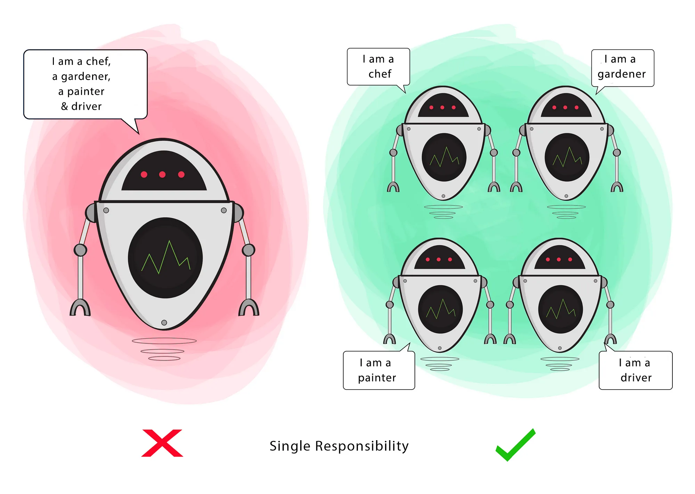
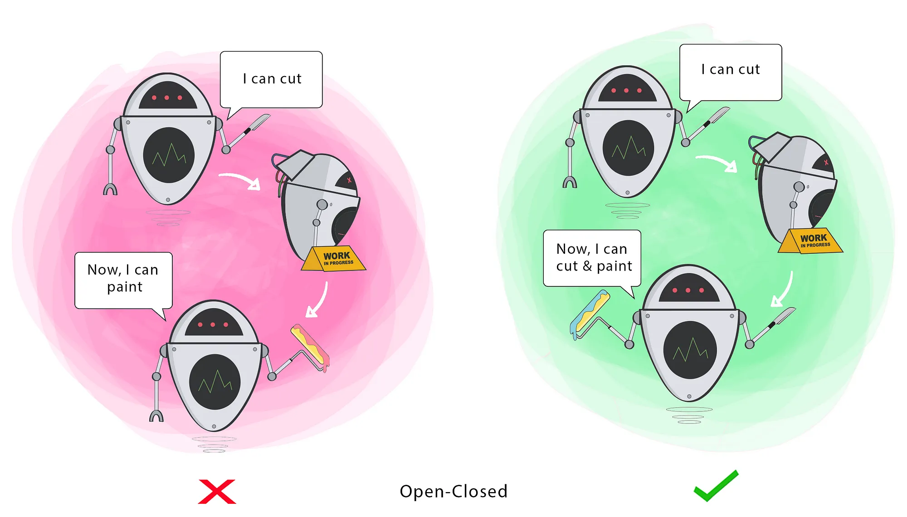

# SOLID

SOLID принципите ни казват как да подреждаме методи и структурите от данни в класовете си,
и как тези класове трябва да бъдат свързани.

Целите на SOLID са да направят кода ни:
- Лесен за промяна.
- Лесен за разбиране 


## Single Responsibility Principle

- Класът трябва да има само 1 причина да се променя.

**Пример:** E-Commerce

```c++
class Employee
{
	save();
	reportHours();
	// ...
	calculatePay(); 
	// Класът не спазва SRP, защото има повече от 1 причина да се променя
	// тук методът calculatePay ще се използва от HR екипът за заплатите
	// методът reportHours ще се използва от мениджърите на служителя
	// save ще се отнася до адиминстраторската част на компанията
	
	// Имайки 3те метода, класът Employee е свързан и с 3те отдела
	// И така това може да накара част от действията на адиминстраторския екип
	// да промени нещо което HR екипът ползва.
}
```



## Open-closed Principle

Обектите трябва да са отворени за разширение, но затворени за промяна,
с други думи: Поведението на един обект трябва да може да се разширява, 
без да е нужно да променяме самия обект. Това е най-важния принцип, защото
ако една малка промяна в кода ни кара да пренаписваме голяма част от него, 
то тогава архитектурата на системата ни има голям проблем.



## Liskov Substitution Principle


## Interface Segregation Principle


## Dependency Inversion Principle


# Design Patterns

Дизайн патърните се разделят на 3 основни вида:
- Creational;
- Behavioural;
- Structural;

**Creational** - осигуряват създаването на обекти, като скриват логиката по тяхното създаване;

**Behavioural** - отговарят за комуникацията между различни видове обекти;

**Structural** - начин за създаване на по-сложни обекти, използвайки инструменти като наследяване и композиция;

## Creational Design Patterns

### Factory

- Статична функция, обвита в клас, която на база някакъв аргумент/и, връща инстанция на даден клас
- Генерално създаване на обекти;

**Пример:**

```c++
class Factory
{
public:
	static Base* baseFactory(...);
}

Base* Factory::baseFactory(...)
{
	// ...
}

// Извикване
Base* ptr = Factory::baseFactory(...);
```

### Singleton

- Осигуряваме само една инстанция на даден клас, към която има глобален достъп
- Едно място, което да достъпваме

**Пример:** База данни

```c++
static Singleton& getInstance()
{
	static Singleton instance;
	return instance;
}
```

- Плюсове:
	- Само една инстанция на даден клас;
	- Глобален достъп;
	- Lazy инициализация - обектът се създава при достъпване на обекта;

- Минуси:
	- Multithreading - трябва да подсигурим, че няма да се достигне до **race condition**;
	- Често се определя като anti-pattern;

### Builder

- В някои ситуации искаме да ни е предоставена възможност даден клас да го инициализираме постъпково;
- Решава някои проблеми на **Factory** за класове с много атрибути, от които много са **optional**;
- За да си гарантираме инициализиране на всички задължителни параметри, трябва **Builder** класът ни да има публичен конструктор
с всички задължителни атрибути като параметри, и **setter** методи за всички опционални параметри;

### Prototype

- Създаване на копие на обекти, без да се интересуваме от техния тип - **clone()**

**Пример:**

```c++
struct Base
{
public:
	virtual Base* clone() const = 0;
	virtual ~Base() noexcept = default;
}

struct Der : Base
{
public:
	virtual Base* clone() const override;
}

Base* Der::clone() const
{
	return new Der(*this);
}
```

## Behavioural Design Patterns

### Command

- Програма, която получава заявки


### Iterator

- Начин за обхождане на колекция, без да се интересуваме каква е тя;
- **Итератор** - указател към конкретен елемент;

- При имплементацията на итератор, задължително трябва да са налични следните оператори:
	- `operator++`, `operator--`, `operator+=`, `operator-=` - указателна аритметика;
	- `operator*` - връща стойността на текущия елемент;
	- `operator->` - връща указател на текущия елемент;
	- `operator==`, `operator!=` - проверки за достигане до края на колекцията;
	
- Колекциите трябва да имат следния интерфейс:
	- `begin()` - връща итератор към началото на колекцията;
	- `end()` – връща итератор към края на колекцията;
	
- Ако искаме да достъпваме елементи на произволни позиции, можем да имплементираме:
	- `operator[]`;
	- `operator+`;
	- `operator-`;

**Пример:**

```c++
template <typename T>
bool search(const T* arr, const T& elem)
{
	const T* iter = arr;
	
	while (iter != nullptr)
	{
		if (*iter == elem)
		{
			return true;
		}
		
		iter++;
	}
	
	return false;
}
```

### Visitor

- Взаимно разпознаване и взаимодействие на обекти от полиморфна йерархия, без да се чупи абстракцията

### Strategy

## Structural Design Patterns

### Flyweight

- Събира повече обекти в паметта, като споделя общите им ресурси
- Подобрява бързодействието, ако създаването на обекти е тежка операция
- Обектите са **immutable**!
- Реализация: **хеш / дърво**